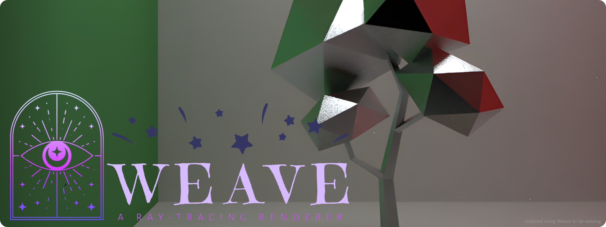

# Weave Renderer 0.1.2
A Ray-Tracing Renderer. On-going personal project.

Release version: v0.1.1

## TODO
- parallelization (mutilthreads cpu, cuda w/ or w/o Optix, etc.)
- HDR map with importance sampling
- BRDF model
- Monte Carlo Intergration (Done)
- Importance Sampling (Done)
- Light Scattering (Done)
- PDF (Done)
- triangle meshes (Done)
- directional light (Done)
- HDR map, skybox (Done)
- PNG output
- adjustable gamma correction

## Warnings
Use GCC instead of Clang in this project.